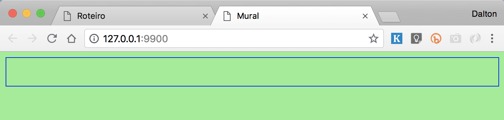
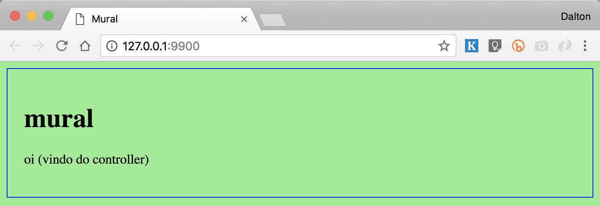

class: center, middle

# Roteiro AngularJS
### ©2018 Dalton Serey, Projeto de Software, UFCG

---
# como funciona este roteiro?

1. cada slide é um passo na construção do app

2. execute cada passo em um terminal linux (via _bash_)

3. você pode copiar e colar os comandos<br>
   (só tenha cuidado para não copiar o `$` que é o _prompt_)

---
# o que você precisará?

> Para seguir este roteiro, você precisará algumas ferramentas.
Certifique-se de que estão devidamente instaladas antes de continuar.

certifique-se de que seu ambiente dispõe das seguintes ferramentas

1. um terminal linux com _bash_ ou equivalente
2. algum editor de textos (vim, atom, etc)
3. `node` e `npm` (opcionalmente, você pode usar `python`)
4. `curl` (opcionalmente, você pode usar o `wget`)

você pode verificar se estão instalados, digitando:

```bash
$ node --version
v10.2.1
$ npm --version
5.6.0
$ curl --version
curl 7.38.0 (x86_64-pc-linux-gnu) …
```

---
class: middle, center, inverse
# parte 1
## arquivos básicos e ambiente

---
# 1. instale um servidor de desenvolvimento

> Há várias opções de servidores de desenvolvimento. Você pode até usar
o servidor simples que vem com `python`, mas é aconselhável usar um
servidor um pouco mais sofisticado. Pra casos simples, uso o
`live-server` abaixo (e é o que usarei nos exemplos do roteiro). Mas
pode ser de seu interesse instalar uma opção mais sofisticada, como
o `browser-sync` que é um dos mais usados. Em compensação, requer
mais argumentos na linha de comando.

escolha uma das opções abaixo (ou instale ambas)

opção 1: [live-server](https://www.npmjs.com/package/live-server)

```bash
$ npm install -g live-server
```

opção 2: [browser-sync](https://www.npmjs.com/package/browser-sync)

```bash
$ npm install -g browser-sync
```

---
# crie um diretório para o app

> Como ocorre com qualquer projeto, é importante manter
todos os arquivos que compõem o app em um diretório próprio para
isso. Tipicamente, será um subdiretório para o _frontend_ contido
no diretório geral do projeto. Aqui, contudo, faremos apenas o
frontend do app. Para isso, usaremos um diretório no seu
diretório _home_.

crie um diretório para o app.footnote[Observe que se você já
tiver um diretório com o nome `mural`, será necessário usar outro
nome ou renomear o diretório original, antes de prosseguir.]

```bash
$ mkdir ~/mural
```

---
# baixe o *angular* no diretório

> Aqui optei por baixar o `angular.min.js` e servi-lo diretamente
do nosso servidor. Na prática, contudo, é muito comum que o script
do angular (e de outros frameworks) seja lido diretamente de
algum CDN. Isso poupa banda passante do servidor e permite
tirar melhor proveito de cache http.

entre no diretório do projeto e baixe o _angular_

```bash
$ cd ~/mural
$ curl https://cdnjs.cloudflare.com/ajax/libs/angular.js/1.7.2/angular.min.js \
  -o angular.min.js
```

verifique que o arquivo foi corretamente gravado
```bash
$ ls
total 344
-rw-r--r--  1 dalton  staff  172105 Jul 10 13:12 angular.min.js
```
---
# crie o arquivo *index.html*

> O arquivo `index.html` é o ponto de entrada do app. Ele contém
> o _html_ básico e instruções sobre os demais arquivos que
> formam o app (neste caso: `app.css`, `angular.min.js` e
> `app.js`). Observe ainda o atributo `ng-app` no elemento `body`
> usado para vincular o módulo angular chamado `"mural"` à DOM.

usando seu editor de textos, crie o arquivo `index.html` contendo:

```html
<!DOCTYPE html>
<html lang="pt-br">
<head>
  <meta charset="UTF-8">
  <title>Mural</title>
  <link rel="stylesheet" type="text/css" href="app.css">
</head>
<body ng-app="mural">
  <!-- Angular JS -->
  <script src="angular.min.js"></script>

  <!-- Aplicação -->
  <script src="app.js"></script>
</body>
</html>
```

---
# crie o arquivo _app.css_

> O arquivo `app.css` conterá os estilos de nossa aplicação.
Por ora, vamos colocar apenas uma única regra, que nos permitirá
verificar que está funcionando devidamente. Mais adiante, ajustaremos
a regra.

usando seu editor de textos, crie o arquivo `app.css` contendo:

```css
body {
    background: lightgreen;
    padding: 20px;
    border: 1px solid blue;
}
```


---
# crie o arquivo _app.js_

> O arquivo `app.js` conterá o código de nossa aplicação. Por
> ora, criaremos apenas o módulo angular que representa nossa
> aplicação angular. Para isso, usaremos o método `module` de
> angular. Ele recebe como parâmetros o nome do módulo e um array
> de dependências (nenhuma dependência por ora). O objeto
> retornado pelo método é um módulo angular que usaremos mais
> adiante. Para isso, o armazenamos na varável `app`. Observe
> ainda que o nome registrado é o nome que devemos usar no
> atributo `ng-app` no `index.html`. É esse nome que vincula a
> aplicação ao DOM.

usando seu editor de textos, crie o arquivo `app.js` contendo:

```javascript
const app = angular.module('mural', []);
```
---
# confira o conteúdo do diretório

> Antes de prosseguir, assegure-se de que o diretório do
projeto contém os 4 arquivos criados. Se faltar algum, reveja
os passos anteriores.

```bash
$ ls -l
total 368
-rw-r--r--  1 dalton  staff  172105 Jul 11 07:09 angular.min.js
-rw-r--r--  1 dalton  staff      84 Jul 11 07:09 app.css
-rw-r--r--  1 dalton  staff      42 Jul 11 08:19 app.js
-rw-r--r--  1 dalton  staff     368 Jul 11 08:17 index.html
```

---
# inicie o servidor de desenvolvimento

> Quando desenvolvemos para _frontend_, é importante podermos 
verificar rapidamente cada pequena mudança feita. Para isso,
usamos um servidor de desenvolvimento que serve localmente os
arquivos da aplicação por http, de forma que possamos testar a
aplicação em um browser, sem a necessidade de fazer _deploy_
(enviar uma cópia para um servidor de produção).

no diretório do projeto, inicie o servidor de
desenvolvimento.ref[1]
.footnote[.ref[1] Se você já estiver
usando a porta 9900, escolha outra porta.]

```bash
$ cd ~/mural
$ live-server --port=9900
```

em um browser, visite o app na url: <a href="http://localhost:9900">http://localhost:9900</a>

---
# o que você deve observar no app?

> Ao visitar o app pela primeira vez, você deve ver apenas uma
página verde claro com uma caixa com borda azul que corresponde
ao elemento `body` cujo estilo é especificado pela única regra
no arquivo `app.css`. Obviamente, este é apenas um stub a partir
do qual vamos desenvolver nossa aplicação. Mas por ora serve ao
propósito de demonstrar que todas as partes estão devidamente
conectadas e em funcionamento.

<br>


---
class: middle, center, inverse
# parte 2
## view, view-model e controller

---
# view, view-model, controller

> Antes de prosseguir, relembre o padrão MVVM que discutimos em
> sala de aula. Relembre que chamamos de view aos elementos
> visuais propriamente ditos que são renderizados pelo browser.
> Na prática, portanto, a view é concretizada
> pelo código html.
>
> O view-model, por sua vez, é um objeto javascript que servirá
> de intermediário entre a view propriamente dita e o model (o
> dado propriamente dito, provavelmente trazido do backend).
>
> Finalmente, o controller é o nome dado à lógica que atua sobre
> o view-model e, possivelmente, sobre o model. O controller é
> o conjunto de _handlers_ que tratam os eventos produzidos pela
> view em resposta ao usuário. Na prática, o controller será o
> código que reúne esses handlers.

---
# controller e view-model

> Em angular, controllers e view-models são definidos juntos
> através de funções construtoras chamadas
> _controllers_.ref[2].footnote[.ref[2] Relembre das aulas teóricas que funções construtoras são invocadas com o operador `new`.].
> A ideia é que “instâncias” da função controller
> atuem como view-model. A função construtora que definimos
> abaixo especifica view-models contendo uma única propriedade:
> `msg`. Observe que definimos a variável `vm` para substituir
> `this`, tal como no padrão `const that = this;` que discutimos nas aulas
> teóricas.

```javascript
function AppCtrl() {
  const vm = this;
  vm.msg = "oi (vindo do controller)";
}
```

> Além de definirmos a função, também é preciso registrá-la em
> nossa aplicação, para que seja reconhecida por angular como
> controller. Para isso, adicione a linha abaixo ao código
> javascript.

```javascript
app.controller('AppCtrl', AppCtrl);
```

---
# view

> Finalmente, temos tudo para conectarmos o controller (e o
> respectivo view-model) à view. Para isso, precisamos editar o
> arquivo `index.html`. Adicionaremos um `div` ao `body` que irá
> atuar como view. Para vinculá-lo corretamente ao controller que
> criamos, usamos a diretiva atributo `ng-controller` com o valor
> `"AppCtrl as vm"`. Dessa forma, informamos a angular: 1) que uma
> instância do controller `AppCtrl` deve ser usada para aquele
> trecho; e 2) que usaremos o nome `vm` nas expressões angular
> para nos referirmos ao view-model correspondente.

adicione um `div` ao html no início do `body`

```html
  <div ng-controller="AppCtrl as vm">
    <h1>mural</h1>
    <p>{{vm.msg}}</p>
  </div>
```

---
# faça reload da aplicação

> Observe que não é uma simples página html. É
> efetivamente uma aplicação funcional. A mensagem que
> apresentada não é parte do html original
> lido pelo browser. É parte do código 
> da função que define o controller. Como
> isso funciona? Ao iniciar o módulo angular, ele procura no DOM
> pela diretiva `ng-app`. Em seguida, dentro desse nó, procura
> pelas diretivas `ng-controller` e instancia um controller (ou
> um view-model) para cada diretiva encontrada. É desse objeto
> que vem a mensagem lida na view.



---
# exercícios

> Modifique a aplicação para compreender melhor o que está
> ocorrendo.

> 1. Adicione outras _properties_ à view-model e
> mostre esses dados na view.
>
> 2. Replique o `div` e veja que a mensagem é mostrada uma vez
> para cada `ng-controller` que aparecer no html.

> 3. Crie outro controller diferente de `AppCtrl` e faça um novo
> `div` que o use. Use _properties_ de tipo numérico.

---
class: middle, center, inverse
# parte 3
## expressões angular e interpolação

---
# expressões angular

> Para exibir dados armazenados no view-model, usamos expressões
> angular, tais como .blue[`{{vm.msg}}`]. Com expressões,
> contudo, podemos manipular os dados antes de exibi-los, de
> forma que podemos derivar dados a partir do view-model.
> A expressão .blue[`{{vm.msg.length}}`], por exemplo, exibe o
> comprimento da string. Já a expressão ternária 
> .blue[`{{vm.condicao ? vm.msg1 : vm.msg2}}`]
> exibiria o conteúdo de .green[`vm.msg1`] ou de .green[`vm.msg2`]
> a depender do valor de .green[`vm.condicao`].
>
> Expressões também podem invocar **métodos no controller**.
> Por exemplo, um controller que defina as _properties_
> .green[`vm.peso`] e .green[`vm.altura`] pode ter também definir
> um método .green[`vm.imc()`] que calcula o IMC. Assim, se a view
> incluir a expressão .blue[`{{vm.imc()}}`] o imc será
> dinamicamente calculado e exibido sempre que o valor das
> properties .green[`vm.peso`] e .green[`vm.altura`] mudar.

---
# prefira colocar lógica nos controllers

> Expressões complexas levam para a view, parte da lógica que
> poderia ser colocada no controller. Embora seja recurso
> conveniente e útil, abusar de seu uso é um _bad smell_ que
> indica quebra de arquitetura.
> 
> A condição ternária do slide anterior, por exemplo, poderia ser
> substituída pela expressão .blue[`{{vm.msg()}}`] que invoca o
> método .green[`vm.msg()`] no view-model/controller que
> implementa a lógica. O pseudo-código abaixo demonstra a
> implementação do controller para esse caso.

```javascript
function MeuController() {
  const vm = this;
  vm.condicao = … 
  vm.msg = function () {
    return vm.condicao ? 'msg1' : 'msg2';
  };
}
```

> Observe que esta abordagem garante que a lógica que
> determina a mensagem fica contida no controller e não espalhada
> pela view (no código html).

---
# two-way data binding

> A view não é mera cópia dos dados no view-model. Trata-se de
> uma vinculação permanente chamada de _two-way data binding_. A
> ideia é que se o dado for modificado, a view será
> automaticamente atualizada por angular. Podemos ver isso em
> funcionamento, modificando a _property_ .blue[`vm.msg`] após
> alguns segundos. Observe que devemos usar o serviço `$timeout`
> de angular ao invés do `setTimeout` de javascript. Mas a ideia
> é a mesma. Atualize o controller de acordo com o código abaixo.
> Observe que o controller recebe `$timeout` como argumento. Mais
> adiante entenderemos isso melhor.

```javascript
function AppCtrl($timeout) {
    const vm = this;
    vm.msg = "oi (vindo do controller)";

    $timeout(function () {
        vm.msg = 'OI!!! (mudado pelo controller)';
    }, 3000)
}
```

Releia a aplicação no browser e observe que em 3 segundos, a
mensagem será automaticamente mudada.

---
# two-way data binding 2

> O nome _two-way data binding_ é usado para expressar que a
> vinculação é bidirecional. A ideia é que quando a view for
> diretamente atualizada pelo usuário, o dado no view-model
> também seja automaticamente modificado. Para experimentar isso,
> atualize o `div` de nosso controller como indicado
> abaixo.

```html
  <div ng-controller="AppCtrl as vm">
    <h1>mural</h1>
    <p>{{vm.msg}}</p>
    <p>comprimento msg: {{vm.msg.length}}</p>
    <p>msg: <input type="text" ng-model="vm.msg"></p>
  </div>
```

> Elementos html do tipo .blue[`input`] são usados para permitir
> que o usuário digite dados na aplicação. Poderíamos ler esse
> dado manualmente com javascript, mas usando _two-way data
> binding_, isso é feito automaticamente. A diretiva
> .blue[`ng-model`] é usada como atributo do .blue[`input`] para
> e permite declarar a _property_ do view-model à qual o valor
> digitado deve ser vinculado (.green[vm.msg] em nosso exemplo).

---
# ng-repeat

> Uma forma recorrente de uso do
> `two-way data binding` é na exibição de dados contidos em
> arrays. Para isso, usamos a diretiva `ng-repeat`. Para
> entender melhor, adicione o `div` abaixo a `index.html`.

```html
  <div ng-controller="MensagensCtrl as vm">
    <h1>mensagens</h1>
    <p>número de mensagens: {{vm.mensagens.length}}</p>
    <div class="msg" ng-repeat="msg in vm.mensagens">
      <div class="msg-texto">{{msg.texto}}</div>
      <div class="msg-autor">{{msg.autor}}</div>
    </div>
  </div>
```

> A `div` acima não é um nó simples. É uma sub-árvore completa.
> Além dos elementos `h1` e `p`, o nó contém um `div` que, por
> sua vez, contém dois outros `div`s. O `div` externo é um
> container de vinculação ao controller e respectivo
> view-model. O `div`
> interno.ref[3].footnote[.ref[3] Os `div`s internos são usados apenas para estruturar os dados para aplicação de estilos.]
> representa **uma** mensagem.
> Contudo, observe que ele tem a diretiva `ng-repeat` usada para
> indicar que, quando a view for _renderizada_, uma cópia do `div`
> deve ser criada para cada um dos valores em .green[`vm.mensagens`].

---
# adicione MensagensCtrl

adicione o código do novo controller ao arquivo `app.js`

```javascript
app.controller('MensagensCtrl', MensagensCtrl);
function MensagensCtrl() {
    const vm = this;
    vm.mensagens = [
        {autor: "fulano",    texto: "mensagem 1"},
        {autor: "beltrano",  texto: "outra mensagem"},
        {autor: "sicrano",   texto: "terceira mensagem"},
        {autor: "beltrano",  texto: "quarta mensagem"}
    ];
}
```

confirme que as mensagens são exibidas, fazendo o _reload_ da aplicação

---
# atualize as regras css

> Para melhorar a visualização, adicione as três regras abaixo
> ao arquivo `app.css`.

```css
.msg {
  margin: 10px 0 10px 0;
  border: 1px solid #aaa;
  background: #cfc;
  border-radius: 8px;
  padding: 10px;
}

.msg-texto {
  color: #088;
}

.msg-autor {
  color: gray;
  font-size: 85%;
}
```

---
class: middle, center, inverse
# parte 4
## modularização

---
# modularização

> Projetos maiores requerem que o código possa ser dividido em
> diferentes arquivos. Por um lado, isso é fácil em JavaScript,
> dado que os scripts são executados no mesmo _namespace_ global.
> Dividir o script em arquivos não é problema. Contudo, isso
> obriga a poluir o _namespace_ global. Para resolver isso,
> angular suporta o conceito de _módulos_. Isso permite que: o
> código de cada script seja executado em uma IIFE, protegendo o
> _namespace_ global; e 2) que as partes tenham acesso aos
> componentes criados nos diferentes scripts.
>
> Para isso, usaremos o método `module` de `angular`.
> No início usamos o método para **criar** um módulo. 
> Veremos agora que o método permite também recuperar um
> módulo existente. A diferença de comportamento é controlada
> pela sintaxe. Se dois parâmetros forem usados, trata-se
> de criação de um módulo. Se houver um único parâmetro,
> trata-se da recuperação de um módulo.

---
# criando e recuperando módulos

use a sintaxe abaixo .green[para declarar/criar] novos módulos…

```javascript
(function () {
  // sintaxe para criação de um módulo
  const mod1 = angular.module('modulo1', []);
}());
```

…e esta .green[para recuperar] um módulo previamente declarado

```javascript
(function () {
  // sintaxe para recuperação de um módulo
  const mod1 = angular.module('modulo1');
}());
```

---
# separe o app em 3 arquivos js… (1/2)

.green[app.js]: declara o módulo da aplicação 
```javascript
(function () {
  const app = angular.module('mural', []);
}());
```

---
# separe o app em 3 arquivos js… (2/2)

.green[app-controller.js]: cria AppCtrl
```javascript
(function () {
  const app = angular.module('mural');
  app.controller('AppCtrl', function AppCtrl() {
    const vm = this;
    vm.msg = "oi (vindo do controller)";
  });
}());
```

.green[mensagens-controller.js]: cria MensagensCtrl
```javascript
(function () {
  const app = angular.module('mural');
  app.controller('AppCtrl', function AppCtrl() {
    const vm = this;
    vm.msg = "oi (vindo do controller)";
  });
}());
```

---
# adicione as referências a index.html

atualize os scripts que devem ser lidos pela aplicação

```html
  <!-- Aplicação -->
  <script src="app.js"></script>
  <script src="app-controller.js"></script>
  <script src="mensagens-controller.js"></script>
```

> Observe que os scripts devem ser lidos nessa ordem, por conta
> da ordem de declaração e uso do módulo `mural`.

---
class: middle, center, inverse
# parte 4
## serviços, models e injeção de dependências

---
# serviços

> _Services_ (ou _providers_) em AngularJS são objetos cujo tempo
> de vida _persiste_ ao longo de toda uma sessão de uso da
> aplicação. Compare isso com controllers (ou view-models) que
> são destruídos sempre que o nó correspondente é eliminado do
> DOM. Isso torna os _services_ o melhor lugar para armazenar
> _models_ (no sentido MVC) da aplicação.
>
> Além disso, uma vez registrados, services podem ser facilmente
> _injetados_ em controllers, de forma que permitem compartilhar
> os _models_ ou outros dados entre controllers e outros
> serviços.

> Infelizmente, Angular provê 5 “receitas” para registrar
> serviços. Essas receitas são: _value_, _factory_, _service_,
> _provder_ e _constant_. Todas elas compartilham algo em comum:
> apenas um único objeto será criado, no primeiro uso do
> service. A partir daí, o mesmo objeto será compartilhado sempre
> que for requisitado.

---
# factory

> O método `factory` de um módulo angular permite registrar um
> serviço de forma extremamente simples. Consiste em passar para
> o método o nome do serviço e uma função que constrói
> (“fabrica”) o objeto _service_ propriamente dito. A receita
> típica é semelhante a esta.

```javascript
(function () {
    const app = angular.module('nome_app');
    app.factory('NomeService', function () {
        const service = {};

        service.dados1 = ["x", "y", …, "z"];
        service.dados2 = "msg";
        service.metodo = function () {
            …
        };
        return service;
    });
}());
```

> O código consiste simplesmente em criar o objeto `service`,
> equipá-lo com os _properties_ necessários (possivelmente, dados
> do servidor) e retornar o objeto. Mas, lembre, só um objeto
> será criado.

---
# adicione um service ao mural

> As mensagens do mural são o exemplo típico de dado (um _model_)
> que precisa ser compartilhado por vários controllers. Vamos,
> portanto, refatorar nosso código, levando os dados para um
> service. Para isso, crie o service abaixo.

```javascript
(function () {
    const app = angular.module('mural');

    app.service('Mensagens', function MensagensCtrl() {
        const service = {};
        service.mensagens = [
            {autor: "fulano",    texto: "mensagem 1"},
            {autor: "beltrano",  texto: "outra mensagem"},
            {autor: "sicrano",   texto: "terceira mensagem"},
            {autor: "beltrano",  texto: "quarta mensagem"}
        ];
        return service;
    });
}());
```

> Lembre-se de complementar isso, atualizando o index.html com o
> arquivo desse service. Sugestão: nomeie o arquivo
> .green[`mensagens-service.js`].

---
# injeção de dependência

> Uma vez criado o service, podemos usá-lo nos controllers ou até
> em outros serviços. Para isso, precisamos usar _injeção de
> dependência_. Felizmente, é só um nome sofisticado para algo
> super simples. A ideia é que você “peça” a angular que o
> serviço seja “injetado” via passagem de parâmetros. Assim,
> quando angular instanciar seu controller ele criará (ou
> recuperará) o serviço nomeado e o passará como parâmetro para a
> função construtora do controller. Isso é feito simplesmente
> adicionando o parâmetro com o nome do serviço a seu controller.
> Relembre, como exemplo, o exercício em que usamos `$timeout`.
> Faremos da mesma forma com os serviços que criarmos.

---
# injete o serviço Mensagens ao controller

> Assim, para adicionar o serviço `Mensagens` que criamos no
> slide anterior ao controller, basta reescrevermos o controller
> da seguinte forma.

```javascript
(function () {
    const app = angular.module('mural');

    app.controller('MensagensCtrl', function MensagensCtrl(Mensagens) {
        vm = this;
        vm.adiciona_mensagem = function () {
            vm.mensagens.push(vm.novo);
        };
        vm.mensagens = Mensagens.mensagens;
    });
}());
```

> Observe que nesta versão do código, optei por colocar a versão
> em estilo _inlined_ no registro do controller.
